# APIGerenciarPessoas
## Do que se trata:
API com CRUD de Pessoas e Endereços com um adendo de listar Pessoa com seus respectivos endereços.
## Tecnologias utilizadas:     

## Como utilizar:
- Utilizar algum software de API Client, para testar esse projeto utilizei Postman, então fica como recomendação.
- Estartar a aplicação em alguma ide que aceite Java.
### Criar Pessoa:
- Escolher como tipo de requisição o POST
- Incluir URI: http://localhost:8080/pessoas
- Selecionar Body 
- Selecionar raw e escolher tipo JSON
- Colocar como body o seguinte Json:
{ "nome":"nomeDaPessoaAqui","dataNascimento":"dataNascimentoDaPessoaAqui" }
- Clicar em Send,exemplo visual abaixo:
  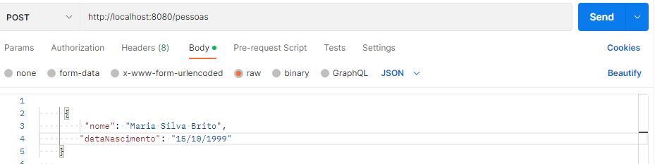
- Saída:
  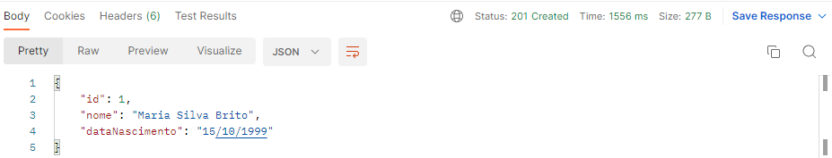
- Como pode notar o status é 201 ou seja foi criado e a aplicação gerou um id para o Json inserido.
### Criar Endereço:
- Escolher como tipo de requisição o POST
- Incluir URI: http://localhost:8080/enderecos
- Selecionar Body
- Selecionar raw e escolher tipo JSON
- Colocar como body o seguinte Json:
- {  
  "pessoaId": O id que foi gerado ao criar a Pessoa,
  "logradouro": "LogradouroDaPessoaAqui",
  "cep": "CepDoEndereçoDaPessoaAqui",
  "numero": "NumeroEndereçoAqui",
  "cidade": "cidadeAqui",
  "enderecoEnum": "Escolher se o endereço é SECUNDARIO ou PRINCIPAL"
  }
- Clicar em Send, exemplo abaixo:
  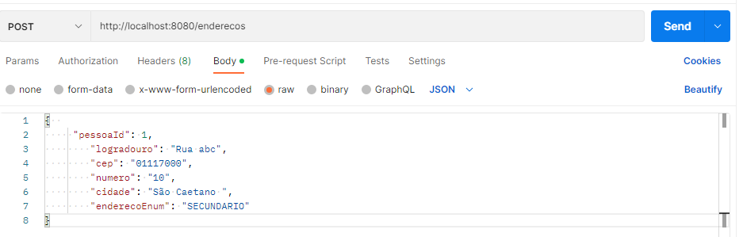
- Saída:
  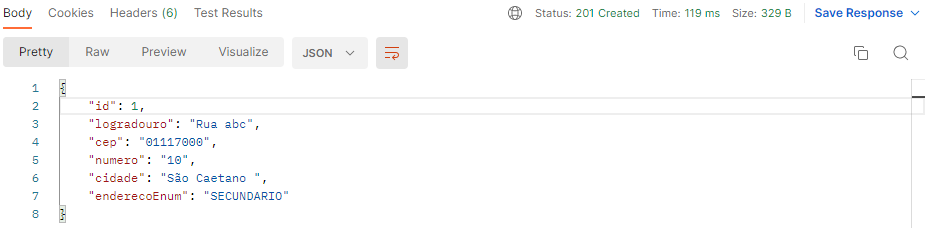
- Como pode notar o status é 201 ou seja foi criado e a aplicação gerou um id para o Json inserido.
### Listar Pessoa com o respectivo endereço:
- Escolher como tipo de requisição como GET
- Incluir URI: http://localhost:8080/pessoas/lista/1
- Clicar em Send
  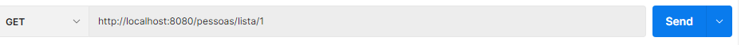
- Saída:
  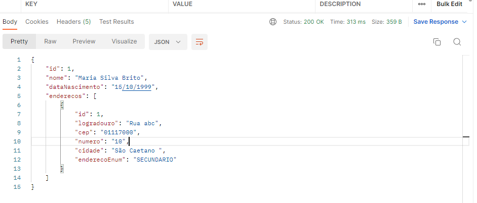
### Listar Pessoas
- Escolher como tipo de requisição o GET
- Incluir URI: http://localhost:8080/pessoas
- Clicar em Send
  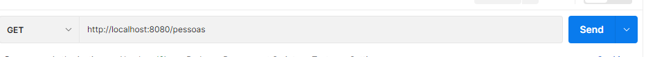
- Saída:
  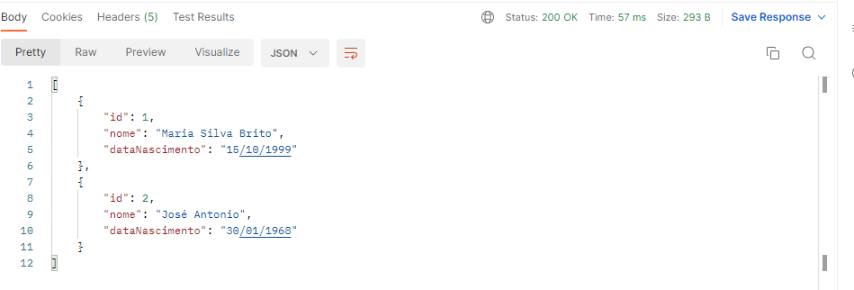
### Listar Endereços
- Escolher como tipo de requisição como GET
- Incluir URI: http://localhost:8080/enderecos
- Clicar em Send
  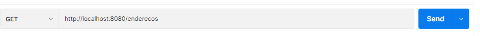
- Saída:
  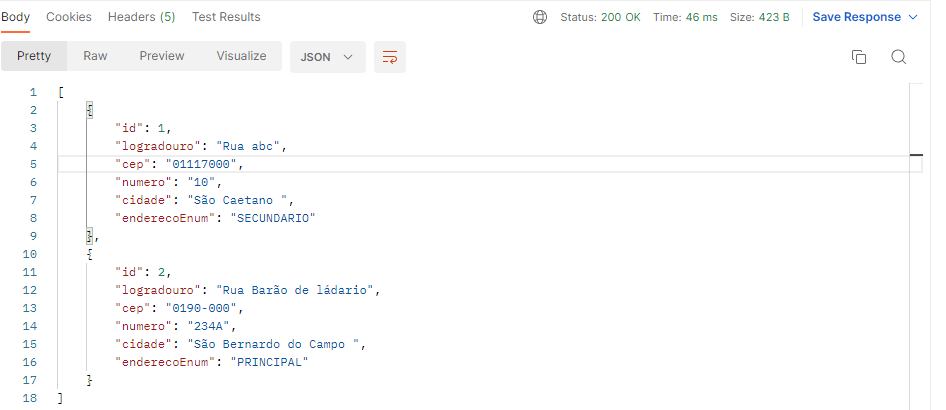
### Update Pessoa
- Escolher como tipo de requisição o PUT
- Incluir URI: http://localhost:8080/pessoas/id
- Selecionar Body
- Selecionar raw e escolher tipo JSON
- Colocar como body o Json com as chaves  necessárias e a alteração no valor
- Exemplo visual abaixo:
  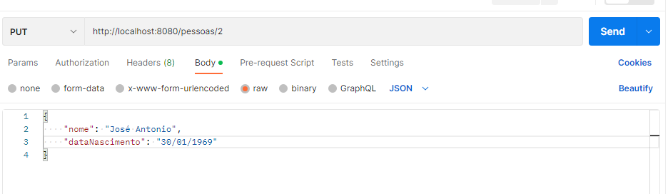
- No caso alterei a data de nascimento
- Saída:
  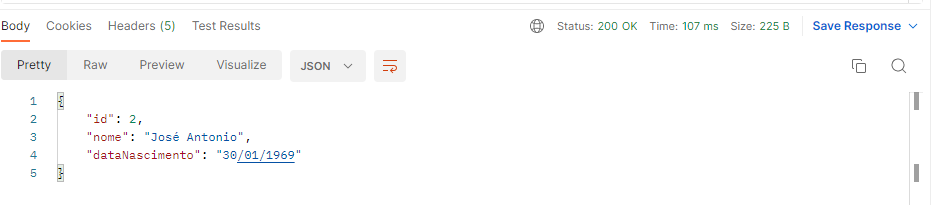
### Lista Pessoa de um id especifico
- Escolher como tipo de requisição o GET
- Incluir URI: http://localhost:8080/pessoas/id
- Clicar em send, estou pesquisando id=2, exemplo abaixo:
 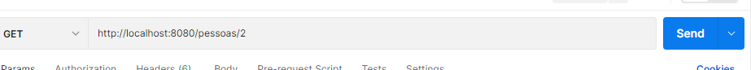
- Saída:
 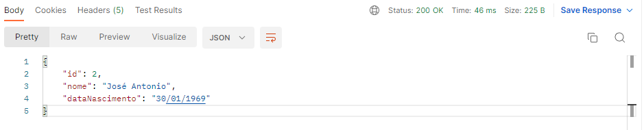
  ###Deletar Pessoa
- Escolher como tipo de requisição o DELETE
- Incluir URI: http://localhost:8080/pessoas/id
- Clicar em Send, e como pode ver no exemplo abaixo status de sucesso na requisição para deletar id=2:
![Delete Pessoa]imgReadme/DeletePessoa.png)
### Update Endereço
- Escolher como tipo de requisição o PUT
- Incluir URI: http://localhost:8080/enderecos/id
- Selecionar Body
- Selecionar raw e escolher tipo JSON
- Colocar como body o  Json com as chaves necessárias com as devidas alterações no valor :
- No exemplo abaixo alterei o logradouron:
  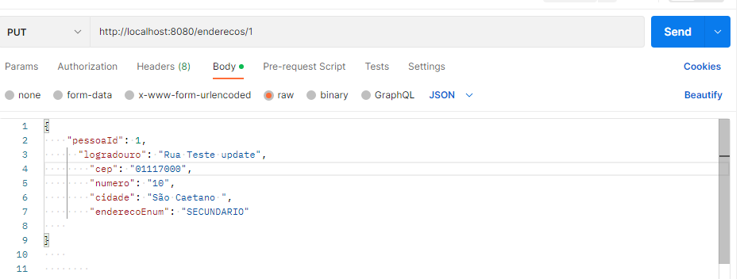
- Saída:
  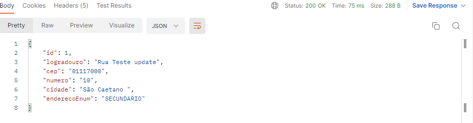
### Listar endereço de um id especifico
- Escolher como tipo de requisição o GET
- Incluir URI: http://localhost:8080/enderecos/id
- Clicar em send, no exemplo abaixo pesquisei endereço com id=1
  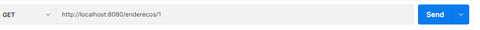
- Saída:
 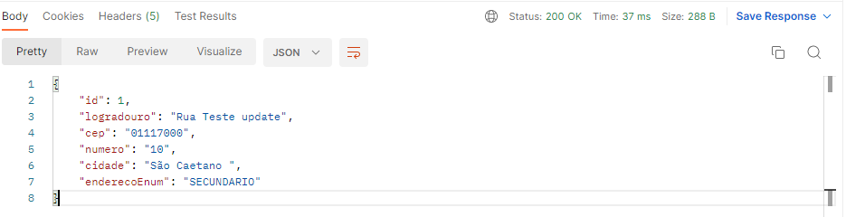
### Delete Endereço
- Escolher como tipo de requisição o DELETE
- Incluir URI: http://localhost:8080/enderecos/id
- Clicar em send, no exemplo abaixo deletei endereço com id=1 e pode notar o status de sucesso na requisição:
  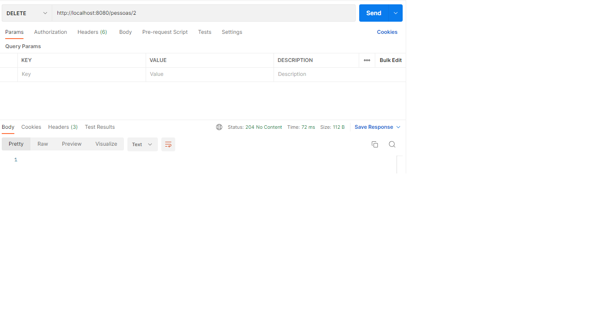
  
